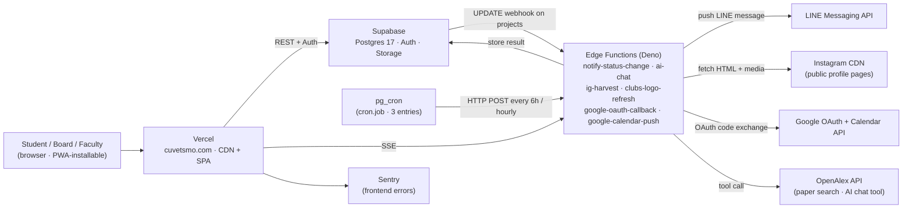
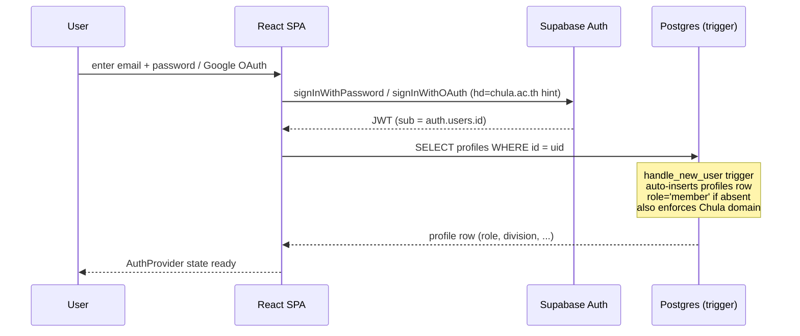
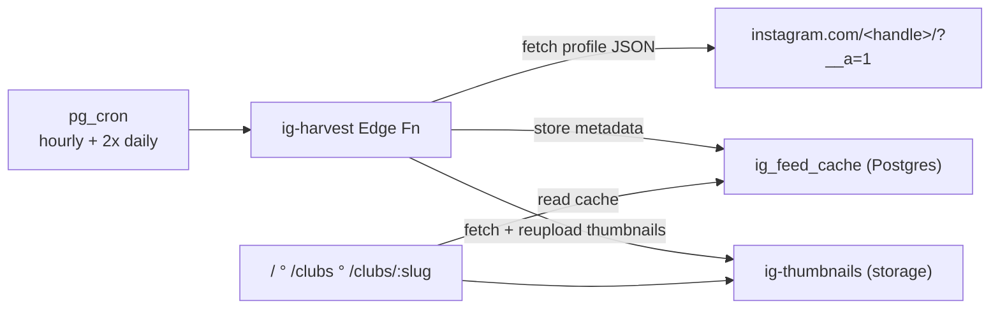

> Deep technical reference for the codebase. If you only need a high-level pitch see the root [`README.md`](https://github.com/palmzamak2547/WebCUVETSMO/blob/main/README.md) instead.
>
> Audience: the next dev (Vet 87 / 88 / 89 · or any open-source contributor) who needs to maintain or extend this system after Palm graduates.
>
> Last verified against the live Supabase project on the date in the most recent git commit. Schema details are checked with `mcp__supabase-cuvetsmo__list_tables` and the SQL files under [`supabase/migrations/`](https://github.com/palmzamak2547/WebCUVETSMO/tree/main/supabase/migrations).

---

## 1. System overview

WebCUVETSMO is a single-page React app hosted on Vercel that talks to Supabase (Postgres + auth + storage + edge functions) for everything stateful. There is no custom Node/Express backend. Background jobs (Instagram harvest, status notifications, Google Calendar push, etc.) live as Supabase Edge Functions and are triggered either by Postgres webhooks or by `pg_cron` rows in the `cron.job` table.



The frontend SPA is the system of record from the user's point of view; Supabase is the system of record from the operator's point of view. Everything in between is an Edge Function.

---

## 2. Tech stack

| Layer | Choice | Notes |
|-------|--------|-------|
| Frontend framework | React 19 | Lazy-loaded routes (see `src/App.tsx`) |
| Build | Vite 6 | ES2018 target keeps older mobile devices supported |
| Routing | React Router 6 | All routes declared in `src/App.tsx` |
| Styling | Tailwind CSS 3 | Brand palette in `tailwind.config.js` (`smo-*` and `stone-*`) |
| Auth + DB + storage | Supabase JS v2 | Single SDK for everything |
| PWA | `vite-plugin-pwa` + Workbox | NetworkFirst cache for REST, precache for shell |
| i18n | `i18next` + `react-i18next` | Locales in `src/locales/` (`th.json`, `en.json`) |
| DOCX export | `docx` npm package | Lazy-imported on click |
| Error monitoring | `@sentry/react` | `VITE_SENTRY_DSN` optional |
| E2E test | `@playwright/test` | `npm run test:smoke` |
| Edge Function runtime | Deno (Supabase) | All in `supabase/functions/` |

See `package.json` for exact versions.

---

## 3. Data model

Every table in `public` has RLS enabled (verified live via `mcp__supabase-cuvetsmo__list_tables`). The table below is the canonical source of truth for the schema. Sources: SQL files under `supabase/migrations/` plus live introspection.

| Table | Purpose | Key FKs / notes | RLS |
|-------|---------|-----------------|-----|
| `profiles` | One row per `auth.users` · holds nickname, role, cohort, division | `id → auth.users.id` · `division → divisions.slug` | yes |
| `divisions` | 20 ฝ่าย (organizational divisions) · seeded | `chair_id → profiles.id` | yes |
| `clubs` | 22 ชมรม (student clubs) · multi-link + cover image + Drive folder | `president_id → profiles.id` · `links` JSONB array | yes |
| `projects` | The killer feature · CUVET 1.0 proposal schema with 16-state workflow | `created_by → profiles.id` · `status` enum | yes |
| `approval_steps` | Immutable history · one row per status transition | `project_id → projects.id` · `actor_id → profiles.id` | yes |
| `project_comments` | Review feedback thread per project · sectioned | `project_id` · `author_id` · `section` (added 0048) | yes |
| `project_documents` | Per-project receipts / photos / signed letters · 10 MB cap | `project_id` · `uploader_id` · `kind` enum · `file_url → storage.bucket(project-documents)` | yes |
| `events` | 12-month event calendar editable by board | `organizer_division → divisions.slug` (optional) | yes |
| `event_photos` | Public-facing photo gallery per event | `event_id → events.id` (nullable for legacy) · `uploader_id` · 0022 added `club_id` link | yes |
| `event_attendance` | Check-in records (0020) · used to drive Activity Transcript | `event_id` · `user_id` · `checked_in_at` | yes |
| `instagram_posts` | Hand-curated featured IG embeds (predecessor to ig_feed_cache) | manual rows | yes |
| `ig_user_ids` | Map of Instagram handle → IG numeric user_id · driver of harvester | unique on `handle` | yes |
| `ig_feed_cache` | Auto-harvested feed (caption, thumbnail, like/comment counts) for embedded IG strip on /clubs etc. | `ig_user_id → ig_user_ids` | yes |
| `faculty_static` | Hardcoded faculty leadership rows (พี่ปุ๋ย, พี่หริ, etc.) not in `profiles` | admin-only write | yes |
| `push_subscriptions` | Web Push endpoints per device | `user_id → profiles.id` | yes |
| `shop_products` | Marketplace listings (Phase shop) | `club_id → clubs.id` | yes |
| `shop_product_variants` | Size/color variants of products | `product_id → shop_products.id` | yes |
| `shop_orders` | Customer orders | `buyer_id → profiles.id` | yes |
| `shop_order_items` | Line items per order | `order_id` · `variant_id` | yes |
| `shop_payment_proofs` | Slip uploads · private bucket | `order_id` · `uploader_id` | yes |
| `shop_payment_ledger` | Append-only payment events (deposit, refund) | `order_id` | yes |
| `app_settings` | Single-row config (feature flags, banner text) · key/value | `id = 1` enforced | yes |
| `meeting_polls` | Real-time meeting polls (Yes/No, multi-choice) | `created_by` | yes |
| `meeting_poll_responses` | Answers · realtime publication for live tally | `poll_id` · `responder_id` | yes |
| `announcements` | Banner / homepage announcements | `published_by` | yes |
| `ai_chat_conversations` | Persisted AI chat threads · per user | `user_id → profiles.id` | yes |
| `ai_chat_messages` | Messages in each thread | `conversation_id` · `role` enum | yes |
| `audit_log` | Append-only record of sensitive writes (role changes, schema edits via admin UI) | `actor_id` · `action` · `target_table` · `target_id` | yes |
| `integration_tokens` | OAuth refresh tokens for Google Calendar push (per admin user) | `user_id` · `provider` · `refresh_token` (encrypted col) | yes |
| `alumni_profiles` | Vet alumni directory (Phase 6 starter) | NEW · sparse use | yes |

> Discrepancy note: the repo's `supabase/functions/` directory contains 5 functions but the live project has 6 (`clubs-logo-refresh` is deployed but its source is not committed). See §6.

---

## 4. Auth + RBAC

Auth is Supabase JWT-based (email/password, magic link, or Google OAuth). The flow is implemented in `src/lib/auth.tsx`:



### Roles

`profiles.role` is the canonical role column. 9 values:

| Role | Who | Powers |
|------|-----|--------|
| `member` | Default for every new signup | Submit project · view own drafts · public reads |
| `chair` | ปธ.ฝ่าย / ปธ.ชมรม | Review projects within own division/club · queue access |
| `vp` | อุปนายก | Review (vp slot) · board access |
| `secretary` | เลขานุการ | Review · board access |
| `president` | นายกสโม | Approve/reject at "ปธ.สโม" step · LINE-notifies on transitions |
| `advisor` | อ.ที่ปรึกษาโครงการ | Approve/reject at "advisor" step |
| `asst_dean` | ผู้ช่วยคณบดีฝ่ายกิจการนิสิต | Approve/reject at "ผู้ช่วยคณบดี" step |
| `dean` | คณบดี | Approve/reject at "คณบดี" step |
| `admin` | Site admins (1-2 people) | Promote/demote roles · edit divisions/clubs/events · CMS |

Role groups are exported from `src/components/ProtectedRoute.tsx`:

- `BOARD_ROLES = ['admin', 'president', 'vp', 'secretary', 'chair']`
- `APPROVAL_ROLES = BOARD_ROLES + ['advisor', 'asst_dean', 'dean']`

### Self-promotion lockdown

A DB trigger (added in `0004_role_lockdown.sql`) blocks any UPDATE to `profiles.role` unless the calling user already has `role = 'admin'`. To bootstrap the very first admin you must temporarily disable the trigger as a DB superuser; see `CONTRIBUTING.md` §"Adding a new admin".

### RLS strategy

Common patterns observed across `supabase/migrations/`:

- **Read-public-write-admin** (`divisions`, `clubs`, `events`, `shop_products`): anon SELECT, only admin/chair/president mutate
- **Read-authenticated** (`profiles`): logged-in users see all profile rows (so admin views and comment authors render)
- **Read-own-or-public-status** (`projects`): owners see their own drafts; everyone sees non-draft rows
- **Insert-by-author** (`approval_steps`, `project_comments`, `project_documents`): only the actor can write
- **Read-own** (`push_subscriptions`, `integration_tokens`, `meeting_poll_responses`): scoped to `auth.uid()`

Every UPDATE policy carries an explicit `WITH CHECK` clause (fixed in `0003_fix_rls_with_check.sql` after a Phase 1 smoke caught the gotcha — without `WITH CHECK`, Postgres falls back to the `USING` clause for new-row validation and silently blocks legitimate state transitions). Subsequent rounds (`0036`, `0038`, `0039`, `0041`) refactored policies to address Supabase performance advisors (RLS initplan + select overlap + scoping personal-data tables to `authenticated`).

---

## 5. Routes

Declared in `src/App.tsx`. Every page is `React.lazy`-imported.

### Public (no auth)

| Path | Page | Notes |
|------|------|-------|
| `/` | Home | Hero · IG strip · announcements |
| `/about` | About | SMO board · faculty leadership |
| `/about/board` | BoardHistory | Past SMO terms |
| `/about/board/:term` | BoardHistory | Specific term snapshot |
| `/clubs` | Clubs | Grid of all 22 clubs |
| `/clubs/:slug` | ClubDetail | Single club · linked feeds |
| `/events` | Events | 12-month calendar |
| `/gallery` | Gallery | Aggregated event photos |
| `/wheel` | Wheel | Spin-wheel utility |
| `/poll/new` | PollCreate | Create meeting poll (anyone) |
| `/poll/:slug` | PollView | Vote on a poll (real-time tally) |
| `/chat` | Chat | AI chat (auth-gated inside the page) |
| `/chat/:conversationId` | Chat | Resume conversation |
| `/docs` | Docs | In-app help |
| `/changelog` | Changelog | Public-facing user changelog |
| `/privacy` | Privacy | Required for Google OAuth verification |
| `/terms` | Terms | Required for Google OAuth verification |
| `/wellbeing` | Wellbeing | Mental-health resources · no analytics hooks |
| `/services` | Services | Hub for Submit · Chat · Shop · Wheel · Poll · ... |
| `/shop` | Shop | Marketplace storefront |
| `/shop/:clubSlug/:productSlug` | ShopProduct | Single product page |
| `/cart` | Cart | Cart contents (local) |
| `/submit` | Submit | Project proposal wizard (auth check inside) |
| `/news` | News | News list |
| `/news/:slug` | NewsPost | Single news post |
| `/login` | Login | 3-mode (password · magic link · Google) |

### Auth required (`<ProtectedRoute>`)

| Path | Page | Roles |
|------|------|-------|
| `/me` | Profile | Any logged-in |
| `/me/transcript` | Transcript | Any logged-in (Activity Transcript) |
| `/me/orders` | MyOrders | Any logged-in |
| `/me/orders/:id` | MyOrders | Any logged-in |
| `/my-drafts` | MyDrafts | Any logged-in |
| `/project/:id` | ProjectDetail | Any logged-in (page does fine-grained check) |
| `/checkout` | Checkout | Any logged-in |
| `/events/:id/checkin` | CheckIn | Any logged-in |
| `/events/:id/photos` | EventPhotos | Any logged-in · upload gated by attendance row |
| `/queue` | ApprovalQueue | `APPROVAL_ROLES` |
| `/analytics` | Analytics | `BOARD_ROLES` |
| `/dashboard` | Dashboard | `president`, `admin`, `vp` |
| `/admin/events/:id/qr` | EventQR | `BOARD_ROLES` |
| `/admin/shop` | AdminShop | `admin`, `chair`, `president` |
| `/admin/orders` | AdminOrders | `admin`, `chair`, `president` |
| `/admin` | Admin | `admin` only |
| `/admin/audit` | AdminAuditLog | `admin` only |
| `/admin/integrations` | AdminIntegrations | `admin` only · Google OAuth callback target |

Catch-all `*` renders `NotFound`.

---

## 6. Edge Functions

Live function list (verified via `mcp__supabase-cuvetsmo__list_edge_functions`):

| Slug | `verify_jwt` | Trigger | What it does |
|------|--------------|---------|--------------|
| `notify-status-change` | true | Postgres webhook on UPDATE `projects` | Fan-out to LINE Messaging API + Discord webhook on status transitions |
| `ai-chat` | true | Frontend POST from `/chat` | Proxies to Groq (Llama 3.3 70B) with OpenAlex tool calling for paper citations · streams SSE · provider chain Groq → Cerebras → OpenRouter fallback |
| `ig-harvest` | true | `pg_cron` (3 schedules) | Scrapes public Instagram profile pages to refresh `ig_feed_cache` and `ig-thumbnails` storage bucket |
| `clubs-logo-refresh` | false | Manual / admin-triggered | Refreshes the `clubs-logos` storage bucket from canonical sources (deployed on server but **source missing from repo** — flag for restoration) |
| `google-oauth-callback` | true | Browser redirect from Google after consent | Exchanges authorization code for tokens · stores in `integration_tokens` |
| `google-calendar-push` | true | Frontend action / admin trigger | Reads `integration_tokens` · pushes `events` rows to the admin's Google Calendar |

### Cron schedule (`cron.job`)

Verified via `SELECT jobname, schedule FROM cron.job`:

| Job | Schedule | URL |
|-----|----------|-----|
| `ig-harvest-cuvetography-priority` | `40 */6 * * *` (every 6h) | `/ig-harvest?handle=cuvetography` |
| `ig-harvest-cuvetsmo-priority` | `10 */6 * * *` (every 6h, offset) | `/ig-harvest?handle=cuvetsmo` |
| `ig-harvest-hourly` | `17 * * * *` (every hour at :17) | `/ig-harvest` (full sweep) |

> Note: the cron rows currently embed the anon JWT in plaintext as `Authorization` headers. This is acceptable because the anon key is public anyway, but rotating it requires rewriting the cron rows.

Source: `supabase/functions/`. One-off setup notes live alongside the function (e.g. `supabase/functions/notify-status-change/SETUP.md`).

---

## 7. MCP servers (`.mcp.json`)

This repo ships an `.mcp.json` so Claude Code / Cursor / any MCP-aware IDE can introspect and manipulate the deployed services without leaving the editor. Five servers are wired:

| Server | What it gives you |
|--------|-------------------|
| `supabase-cuvetsmo` | DB introspection (`list_tables`, `execute_sql`, `list_migrations`), edge function deploy, log streaming · uses a project-scoped PAT |
| `vercel` | Deploy status, env vars, domain config, logs · uses a user PAT |
| `playwright` | Browser automation (snapshot, click, fill) for e2e debugging |
| `lazyweb` | 257k UI-pattern reference screenshots · `/design-research`, `/design-improve` skill workflows |
| `figma` | Pull design tokens / variables from Palm's Figma file |

> **Security**: `.mcp.json` contains real tokens. It is gitignored. The committed copy is `.mcp.json.example` if you need to bootstrap. Treat tokens like you would `.env`.

---

## 8. Storage buckets

Listed live from `storage.buckets`:

| Bucket | Public | Purpose | RLS pattern |
|--------|--------|---------|-------------|
| `avatars` | yes | Profile photos · `<user_id>/avatar-<ts>.<ext>` | uploader = `auth.uid()` |
| `clubs-logos` | yes | Club brand assets · `<slug>/logo.png` | admin/chair write |
| `event-photos` | yes | Public photo gallery · `<event_id>/<filename>` | uploader must have `event_attendance` row |
| `ig-thumbnails` | yes | Cached IG thumbnails populated by `ig-harvest` | service-role-only writes |
| `project-documents` | yes | Receipts / photos / signed letters per project · `<project_id>/<uploader_id>/<file>` | uploader = `auth.uid()` AND row references uploader's project |
| `shop-payment-proofs` | **no** | Slip uploads · private | buyer-only read |
| `shop-products` | yes | Product images · `<club_slug>/<product_slug>/...` | admin/chair write |

Detailed bucket-RLS rules are in `0005_storage_buckets.sql` and `0033_clubs_logos_storage_rls.sql`.

---

## 9. Critical code paths

### 9.1 Submit wizard

`src/pages/Submit.tsx` is an 8-section form that mirrors the official CUVET 1.0 template (see [`sa.chula.ac.th`](https://www.sa.chula.ac.th/wp-content/uploads/2018/10/7.%E0%B9%81%E0%B8%9A%E0%B8%9A%E0%B8%9F%E0%B8%AD%E0%B8%A3%E0%B9%8C%E0%B8%A1%E0%B8%95%E0%B8%B1%E0%B8%A7%E0%B8%AD%E0%B8%A2%E0%B9%88%E0%B8%B2%E0%B8%87%E0%B8%81%E0%B8%B2%E0%B8%A3%E0%B9%80%E0%B8%82%E0%B8%B5%E0%B8%A2%E0%B8%99%E0%B9%82%E0%B8%84%E0%B8%A3%E0%B8%87%E0%B8%81%E0%B8%B2%E0%B8%A3.pdf)). Schema is defined in `src/lib/projectFormSchema.ts`.

- Auto-save → `localStorage` keyed by draft id
- "Save to cloud" → INSERT/UPDATE on `projects` (RLS: owner can write only when `status='draft'`)
- "Download .docx" lazy-imports the `docx` package and calls `src/lib/docxFullProposal.ts`
- "Submit for review" sets `status='submitted-to-chair'` and triggers the `notify-status-change` webhook

### 9.2 Approval workflow

16-state machine for `projects.status`:

```
draft
  └─ submitted-to-chair ──→ chair-approved ──→ advisor-approved
      └─ assist-dean-approved ──→ dean-approved
          └─ in-progress ──→ completed ──→ post-report-submitted ──→ archived
At any review step: ──→ rejected
```

Owner transitions (`draft → submitted-to-chair`, `completed → post-report-submitted`) are gated by `projects_update_own_draft`. Reviewer transitions are gated by `projects_update_reviewer` which checks the actor's role matches the next step.

Implementation: `src/pages/ApprovalQueue.tsx` filters by role + next-status. `src/pages/ProjectDetail.tsx` renders the approve/reject buttons and writes `approval_steps`.

### 9.3 IG harvest pipeline



The function is rate-limit sensitive — IG throttles aggressive scraping. The split 3-schedule design (full sweep hourly + per-handle priority every 6h) was tuned for that.

### 9.4 AI chat (FAQ cache → intent classifier → tool calls)

`supabase/functions/ai-chat/index.ts` is a multi-provider, multi-round tool-call loop:

1. Authenticated POST from `/chat` with `messages` array
2. Inject USER CONTEXT (role · division · cohort) into the system prompt
3. Non-streaming Groq call up to 3 rounds — if `tool_calls` present, run `search_openalex` and `search_docs` in parallel, append results, re-call
4. When the model returns text instead of tool calls, re-call with `stream: true` and forward each delta as an SSE `delta` event
5. Provider fallback chain: Groq → Cerebras → OpenRouter on 429 / 5xx
6. Persist conversation + messages to `ai_chat_conversations` / `ai_chat_messages` for resume

### 9.5 Auth flow

See §4 sequence diagram. Three sign-in modes (email/password, magic link, Google OAuth) all enforce the Chula domain at three layers: client-side check in `auth.tsx`, Supabase Auth allow-list, and DB trigger on `profiles` insert.

### 9.6 Google Calendar integration

The OAuth dance lives in two pieces:

- Browser → `/admin/integrations` initiates `signInWithOAuth({ provider: 'google', scopes: 'openid email profile https://www.googleapis.com/auth/calendar.events' })`
- Google redirects to `google-oauth-callback` Edge Function, which exchanges the code, stores the refresh token in `integration_tokens` (encrypted column), and bounces the user back to `/admin/integrations` with success state
- Admin clicks "Push to Calendar" → `google-calendar-push` Edge Function reads `integration_tokens`, refreshes access token, calls Calendar API `events.insert` for each row in `events`

> Scope `openid` MUST be first — without it Google omits `id_token` (a known gotcha · see Palm's memory `feedback_oauth-openid-scope-required`).

---

## 10. Build + bundle layout

After the Phase 5 code-split:

- **Initial chunk** ~250 KB gzip: React + react-router + Tailwind + `AuthProvider` + Header/Footer
- **Per-page chunks** lazy via `React.lazy` — each route fetches on first navigation
- **`docx` chunk** ~110 KB gzip: only loaded when user clicks "Download .docx"
- **Service worker** precaches the initial shell · NetworkFirst for Supabase REST · skipWaiting=true so refreshes propagate fast

Build config: `vite.config.ts`. ES2018 target keeps Safari 12 and older Android Chrome alive.

---

## 11. Known discrepancies + open questions

- **`clubs-logo-refresh` Edge Function is deployed but its source is missing from `supabase/functions/` in the repo.** Pull it down via `npx supabase functions download clubs-logo-refresh` before any teardown/rebuild of the project.
- **`_RUN_PENDING_2026-05-09.sql`** is a one-off catch-up bundle living in the migrations folder. Future contributors should not edit it; it exists for the Phase 2 re-bootstrap event.
- **Faculty leadership** (พี่ปุ๋ย, พี่หริ, etc.) lives in `faculty_static` rather than `profiles` because faculty don't sign up. Updates require an admin running SQL.
- **`groupId` for LINE notifications** is currently Palm's DM. The board-group switch is held pending นายกสโม 69 buy-in (see `project_webcuvetsmo-line-target-switch` memory).
- **Activity transcript** uses `event_attendance` but the export-PDF surface in `src/pages/Transcript.tsx` is still feature-flagged behind low row counts.
- **`alumni_profiles`** is provisioned (Phase 6 starter) but currently has zero rows in production.

---

## 12. Where to go next

- Onboarding a new contributor: see [Developer Onboarding](/dev-onboard/)
- Annual handover ritual: see [Successor Guide](/successor/)
- SSO design (cross-app identity): see [SSO Design](/architecture-sso/)
- Operational runbooks (incidents, cost spikes) live in the `docs/` folder of the source repo
